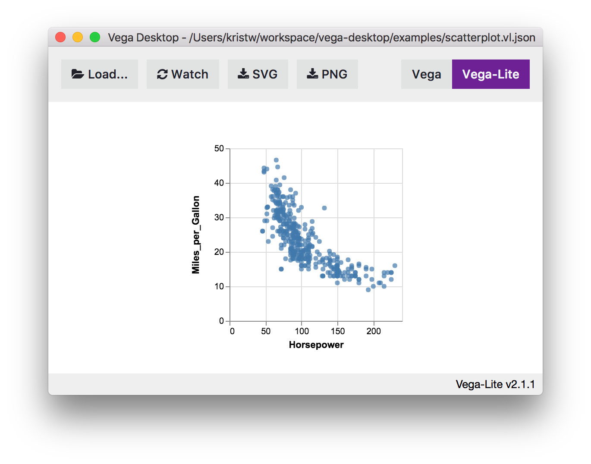
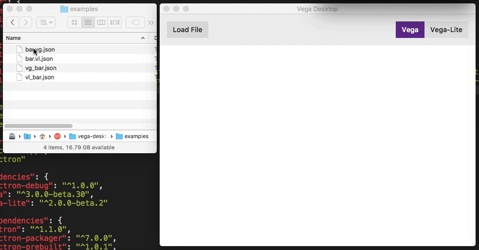
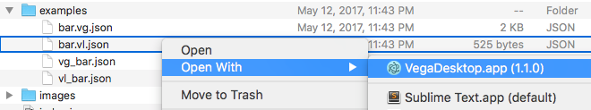

# Vega-Desktop

> App for viewing visualizations created in Vega or Vega-lite

**Download:**
[Linux armv7l](https://goo.gl/xfmqqo) |
[Linux x32](https://goo.gl/KAer4q) |
[Linux x64](https://goo.gl/9WYQXB) |
[Mac OS X](https://goo.gl/PmhGC7) |
[Windows x32](https://goo.gl/VHQdsw) |
[Windows x64](https://goo.gl/QyhBPu)

To download previous versions, please see [CHANGELOG](CHANGELOG.md).




#### Features

- Can read both vega and vega-lite files.
- Save output as `svg` or `png` from UI.
- Can determine the file format if the extension is `*.vg.json` or `*.vl.json`.
- If the extension is just `*.json`, will check for `$schema` field in the JSON spec.
- Otherwise will try to parse as vega-lite, then vega.
- It will load external data files relative to the spec files directory.

You also can set your OS to have `*.vg.json` or `*.vl.json` opened with vega-desktop by default.



## Dev

```bash
npm install # yarn install has issue with electron-packager. Have to use npm install
npm start
```

### Build

```bash
npm run build
```

Builds the app for OS X, Linux, and Windows, using [electron-packager](https://github.com/electron-userland/electron-packager).


## License

MIT © [Krist Wongsuphasawat](http://kristw.yellowpigz.com)
